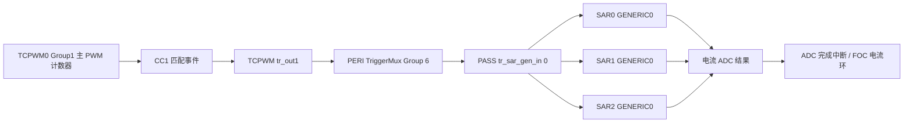
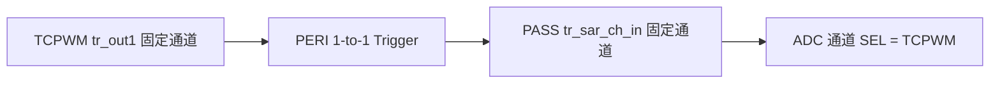

# CYT2BL3 FOC：TCPWM 触发 ADC 采样链路

## 1. 先给结论

这颗 CYT2BL3（TRAVEO T2G TVII-B-H-4M）有两种可用的 TCPWM 触发 ADC 方式：

1. **TCPWM 到 ADC 通道的一对一专用触发**
   - 链路短，配置简单。
   - TCPWM 通道和 SAR 通道的对应关系固定。
   - ADC 通道配置为 `CY_ADC_TRIGGER_TCPWM`。

2. **TCPWM 经过 TriggerMux，进入 PASS 通用触发输入**
   - ADC 引脚和通道选择更自由。
   - 一个主 PWM 触发源可以同时送给 SAR0、SAR1、SAR2。
   - 更适合 FOC 的多路同步电流采样。
   - ADC 通道配置为 `CY_ADC_TRIGGER_GENERIC0`。

本工程建议先使用第 2 种：**主 PWM 的 CC1 匹配事件 -> TCPWM tr_out1 -> TriggerMux Group 6 -> PASS generic trigger 0 -> SAR0/SAR1/SAR2 -> ADC 转换完成中断 -> FOC 电流环**。



---

## 2. 数据手册中的关键寄存器

数据手册：`CYT/数据手册/原文.pdf`。

| PDF 页码 | 寄存器 | 作用 |
| --- | --- | --- |
| 1578 | `PASS_SAR_CH_TR_CTL` | ADC 通道选择软件、TCPWM、GENERIC0 等触发源 |
| 1596 | `PASS_SAR_TR_IN_SEL` | 每个 SAR 的 GENERIC0~4 从 PASS 通用触发线中选择一路 |
| 1616 | `PERI_TR_1TO1_GR_TR_CTL` | 打开 TCPWM 到 ADC 通道的一对一专用触发 |
| 2468~2469 | `TCPWM_GRP_CNT_CTRL` | 控制 CC0/CC1 在向上、向下计数时是否产生匹配事件 |
| 2496 | `TCPWM_GRP_CNT_TR_OUT_SEL` | 选择 `tr_out0`、`tr_out1` 由哪个内部事件产生 |

`TCPWM_GRP_CNT_TR_OUT_SEL.OUT1` 可以选择：

- `OVERFLOW`
- `UNDERFLOW`
- `TC`，即 Terminal Count
- `CC0_MATCH`
- `CC1_MATCH`
- `LINE_OUT`
- `DISABLED`

SDK 中对应枚举为：

```c
CY_TCPWM_COUNTER_OVERFLOW
CY_TCPWM_COUNTER_UNDERFLOW
CY_TCPWM_COUNTER_TERMINAL_COUNT
CY_TCPWM_COUNTER_CC0_MATCH
CY_TCPWM_COUNTER_CC1_MATCH
CY_TCPWM_COUNTER_LINE_OUT
CY_TCPWM_COUNTER_DISABLED
```

这些枚举均已在当前工程的 `cy_tcpwm.h` 中确认存在。

---

## 3. 为什么建议用 CC1 作为 ADC 采样定时点

FOC 的三相占空比一般由 `CC0` 控制，因此不要拿 `CC0_MATCH` 直接作为固定 ADC 采样点，否则采样时刻会跟着占空比变化，容易刚好落到 MOS 管切换和电流尖峰附近。

Group1 电机控制 TCPWM 还有独立的 `CC1`：

- `CC0`：控制 PWM 占空比。
- `CC1`：单独安排 ADC 采样时刻。
- `trigger1EventCfg = CY_TCPWM_COUNTER_CC1_MATCH`：CC1 匹配时产生 `tr_out1`。
- `cc1MatchMode = CY_TCPWM_PWM_TR_CTRL2_NO_CHANGE`：CC1 只产生事件，不改变 PWM 输出。

中心对齐 PWM 的计数过程为：

```text
0 -> PERIOD -> 0 -> PERIOD -> 0 ...
```

如果 CC1 的上下计数匹配都打开，一个完整 PWM 周期会产生两次触发。只想每个 PWM 周期采样一次时，可只打开一个方向：

```c
TCPWM0_GRP1_CNT0->unCTRL.stcField.u1CC1_MATCH_UP_EN   = 1u;
TCPWM0_GRP1_CNT0->unCTRL.stcField.u1CC1_MATCH_DOWN_EN = 0u;
```

这样 ADC 每个完整的中心对齐 PWM 周期只触发一次，并且采样点由 `CC1` 决定。

### 推荐的第一版采样点

对于三电阻低侧采样，可先把采样点放在计数器从 0 向上计数后的一个小延时位置：

```text
CC1 = 死区时间对应计数值 + 运放建立时间对应计数值 + 安全余量
```

不要一开始就把 CC1 写成 0。虽然计数器底部通常是低侧导通区，但 ADC、运放和开关节点需要一定建立时间。

如果使用母线单电阻、双电阻重构或采样窗口会随扇区改变，则 CC1 需要由 SVPWM 扇区和有效矢量时间动态计算，不能一直使用固定值。

---

## 4. 推荐链路：通用触发广播

以下示例使用：

- 主定时器：`TCPWM0_GRP1_CNT0`
- 主定时器输出触发：`tr_out1[256]`
- TriggerMux 输入：`TRIG_IN_MUX_6_TCPWM_16M_TR_OUT10`
- PASS 通用触发线：`TRIG_OUT_MUX_6_PASS_GEN_TR_IN0`
- SAR0/SAR1/SAR2 的 `GENERIC0` 都选择 PASS 通用触发线 0

注意 `TR_OUT10` 的名称含义是 **tr_out1 + counter 0**，不是十号输出。

### 4.1 TCPWM 配置关键项

```c
cy_stc_tcpwm_pwm_config_t Pwm_config;

memset(&Pwm_config, 0, sizeof(Pwm_config));

Pwm_config.pwmMode          = CY_TCPWM_PWM_MODE_DEADTIME;
Pwm_config.countDirection   = CY_TCPWM_COUNTER_COUNT_UP_DOWN1;
Pwm_config.runMode          = CY_TCPWM_PWM_CONTINUOUS;
Pwm_config.period           = FOC_PWM_PERIOD_COUNT;
Pwm_config.compare0         = FOC_PWM_PERIOD_COUNT / 2u;
Pwm_config.compare1         = FOC_ADC_SAMPLE_COUNT;
Pwm_config.cc0MatchMode     = CY_TCPWM_PWM_TR_CTRL2_INVERT;
Pwm_config.cc1MatchMode     = CY_TCPWM_PWM_TR_CTRL2_NO_CHANGE;
Pwm_config.overflowMode     = CY_TCPWM_PWM_TR_CTRL2_SET;
Pwm_config.underflowMode    = CY_TCPWM_PWM_TR_CTRL2_CLEAR;
Pwm_config.trigger0EventCfg = CY_TCPWM_COUNTER_TERMINAL_COUNT;
Pwm_config.trigger1EventCfg = CY_TCPWM_COUNTER_CC1_MATCH;

Cy_Tcpwm_Pwm_Init(TCPWM0_GRP1_CNT0, &Pwm_config);
```

`FOC_PWM_PERIOD_COUNT` 和 `FOC_ADC_SAMPLE_COUNT` 属于工程级固定参数，按你的代码规范放进 `My_TCPWM.h`。

### 4.2 修正比较事件方向使能

当前工程所带的 `Cy_Tcpwm_Pwm_Init()` 使用一个清零后的 `CTRL` 临时变量，但没有给下面四个匹配使能位赋值：

- `CC0_MATCH_UP_EN`
- `CC0_MATCH_DOWN_EN`
- `CC1_MATCH_UP_EN`
- `CC1_MATCH_DOWN_EN`

而数据手册给出的复位默认值是 1。因此调用初始化函数后，建议显式写回：

```c
TCPWM0_GRP1_CNT0->unCTRL.stcField.u1CC0_MATCH_UP_EN   = 1u;
TCPWM0_GRP1_CNT0->unCTRL.stcField.u1CC0_MATCH_DOWN_EN = 1u;
TCPWM0_GRP1_CNT0->unCTRL.stcField.u1CC1_MATCH_UP_EN   = 1u;
TCPWM0_GRP1_CNT0->unCTRL.stcField.u1CC1_MATCH_DOWN_EN = 0u;
```

如果三相 PWM 使用 Group1 CNT0、CNT1、CNT2，这些位需要给三个计数器分别配置。三相计数器还必须同步启动，不能把三个独立的软件启动调用当成严格同步。

### 4.3 TriggerMux 路由

这里输入和输出都属于 TriggerMux Group 6，因此只需要调用一次 `Cy_TrigMux_Connect()`，不需要走两级跨组连接。

```c
cy_en_trigmux_status_t Trigger_status;

Trigger_status = Cy_TrigMux_Connect(
    TRIG_IN_MUX_6_TCPWM_16M_TR_OUT10,
    TRIG_OUT_MUX_6_PASS_GEN_TR_IN0,
    CY_TR_MUX_TR_INV_DISABLE,
    TRIGGER_TYPE_EDGE,
    0u);
```

`TRIGGER_TYPE_EDGE` 会在接收外设时钟域内同步触发，并形成两周期脉冲，适合作为 ADC 启动事件。

初始化代码必须检查 `Trigger_status == CY_TRIGMUX_SUCCESS`，不能忽略连接失败。

### 4.4 三相占空比硬件同步

主计数器的 `tr_out0[256]` 输出 TC 事件，通过 TriggerMux 接到 TCPWM 公共输入 1：

```c
(void)Cy_TrigMux_Connect(
    TRIG_IN_MUX_4_TCPWM_16M_TR_OUT00,
    TRIG_OUT_MUX_4_TCPWM_ALL_CNT_TR_IN1,
    CY_TR_MUX_TR_INV_DISABLE,
    TRIGGER_TYPE_EDGE,
    0u);
```

公共输入 1 对应各 TCPWM 计数器的 `TRIG4`。三相 PWM 将 Compare0 Swap 输入配置为 `TRIG4` 上升沿后，`My_TCPWM_SetDuty()` 只需写入三相 `CC0_BUFF`，主计数器每次产生 TC 事件时便会由硬件同步交换三相 `CC0` 与 `CC0_BUFF`。

该机制是交换而不是单向装载。控制环必须在每个 PWM 周期都写入三相占空比，即使占空比未变化也不能跳过；否则新旧比较值可能在后续周期交替生效。

### 4.5 让三个 SAR 的 GENERIC0 都选择通用触发线 0

```c
Cy_Adc_SetGenericTriggerInput(PASS0_EPASS_MMIO, 0u, 0u, 0u);
Cy_Adc_SetGenericTriggerInput(PASS0_EPASS_MMIO, 1u, 0u, 0u);
Cy_Adc_SetGenericTriggerInput(PASS0_EPASS_MMIO, 2u, 0u, 0u);
```

参数依次为：

```text
PASS 实例、SAR 编号、SAR 内部 GENERIC 编号、PASS 通用触发线编号
```

三行代码表示：

- SAR0 的 GENERIC0 <- PASS generic trigger 0
- SAR1 的 GENERIC0 <- PASS generic trigger 0
- SAR2 的 GENERIC0 <- PASS generic trigger 0

因此一次主 PWM 触发可以让三个 SAR 同时开始各自的转换。

### 4.6 ADC 通道配置

ADC 通道初始化时把触发源改成 `CY_ADC_TRIGGER_GENERIC0`：

```c
cy_stc_adc_channel_config_t Adc_channel_config;

memset(&Adc_channel_config, 0, sizeof(Adc_channel_config));

Adc_channel_config.triggerSelection = CY_ADC_TRIGGER_GENERIC0;
Adc_channel_config.channelPriority  = 0u;
Adc_channel_config.preenptionType   = CY_ADC_PREEMPTION_FINISH_RESUME;
Adc_channel_config.pinAddress       = Current_pin_address;
Adc_channel_config.sampleTime       = Current_sample_count;
Adc_channel_config.isGroupEnd       = true;
Adc_channel_config.mask.grpDone     = true;

Cy_Adc_Channel_Init(Current_adc_channel, &Adc_channel_config);
Cy_Adc_Channel_Enable(Current_adc_channel);
```

其中 `Current_adc_channel` 和 `Current_pin_address` 必须根据最终电流采样引脚填写。它们不是 SDK 中现成的变量名，只是说明此处需要传入实际通道，例如：

```c
PASS0_SAR0_CH0
PASS0_SAR1_CH4
PASS0_SAR2_CH4
```

对应的 `pinAddress` 分别应填写真实 SAR 通道号。配置硬件触发后，不要再调用 `Cy_Adc_Channel_SoftwareTrigger()` 启动周期采样。

数据手册还要求：修改 `PASS_SAR_CH_TR_CTL` 前，必须先禁用该 ADC 通道或禁用 SAR IP。

---

## 5. 一对一专用触发链路

固定通道正好匹配时，可以使用专用线路：



例如 TCPWM Group1 CNT0 的 `tr_out1[256]` 固定连接到 SAR0 CH0：

```c
Cy_TrigMux_Connect1To1(
    TRIG_OUT_1TO1_1_TCPWM_TO_PASS_CH_TR0,
    CY_TR_MUX_TR_INV_DISABLE,
    TRIGGER_TYPE_EDGE,
    0u);

Adc_channel_config.triggerSelection = CY_ADC_TRIGGER_TCPWM;
```

Group1 电机控制计数器与 ADC 通道的前四组对应关系如下：

| TCPWM Group1 计数器 | 固定 ADC 通道 |
| --- | --- |
| CNT0 | SAR0 CH0 |
| CNT1 | SAR1 CH0 |
| CNT2 | SAR2 CH0 |
| CNT3 | SAR0 CH1 |
| CNT4 | SAR1 CH1 |
| CNT5 | SAR2 CH1 |
| CNT6 | SAR0 CH2 |
| CNT7 | SAR1 CH2 |
| CNT8 | SAR2 CH2 |
| CNT9 | SAR0 CH3 |
| CNT10 | SAR1 CH3 |
| CNT11 | SAR2 CH3 |

可以看出，它是按 SAR0、SAR1、SAR2 交错排列的。若 PCB 上的电流采样脚没有落在这些固定通道上，就不要硬套一对一方案，改用第 4 节的通用触发广播。

---

## 6. ADC 完成以后，FOC 应该在哪里运行

推荐流程：

```text
PWM CC1 事件
  -> ADC 硬件采样
  -> ADC group done
  -> ADC 中断
  -> 读取 Ia、Ib、母线电压等结果
  -> 零偏和比例换算
  -> Clarke
  -> Park
  -> Id/Iq PI
  -> 反 Park
  -> SVPWM
  -> 写入三个 CC0 buffer
  -> 下一个 PWM 周期统一生效
```

中断中可使用当前 SDK 已存在的接口：

```c
Cy_Adc_Channel_GetInterruptMaskedStatus();
Cy_Adc_Channel_GetResult();
Cy_Adc_Channel_ClearInterruptStatus();
```

先选择其中一个 SAR 的最后完成通道作为 FOC 中断源，避免 SAR0、SAR1、SAR2 各进一次中断。进入中断后再检查其他 SAR 的结果有效状态，确保三路数据属于同一个 PWM 周期。

如果采样通道分别位于三个 SAR，它们是真正并行转换；如果多个采样通道都放在同一个 SAR，只能由该 SAR 的序列器依次转换，不是同一时刻采样。

---

## 7. 初始化顺序

建议严格按照下面的顺序配置：

1. 配置系统时钟。
2. 配置 ADC 外设时钟和模拟 GPIO。
3. 初始化 SAR0/SAR1/SAR2。
4. 在 ADC 通道未使能时配置通道参数和硬件触发源。
5. 配置 `Cy_Adc_SetGenericTriggerInput()`。
6. 配置 TriggerMux 路由。
7. 初始化三个中心对齐 PWM 计数器。
8. 修正 CC0/CC1 上下计数匹配使能位。
9. 清除 ADC 和 TCPWM 的旧中断标志。
10. 使能 ADC 通道。
11. 使能 ADC 中断。
12. 使能三个 PWM 计数器，并进行同步启动。

重点是：**先把 ADC 和触发路由全部准备好，最后再启动 PWM。** 否则初始化过程中可能出现一次非预期 ADC 转换或不完整的第一组数据。

---

## 8. 第一阶段调试方法

不要一开始就接完整 FOC 算法，按下面顺序验证：

### 第一步：验证 PWM

- 三相 PWM 频率是否正确。
- 三个中心对齐计数器是否同步。
- 互补输出和死区是否正确。
- 关闭功率级或保持母线低压调试。

### 第二步：验证触发次数

在 ADC 完成中断中翻转一个 GPIO：

- GPIO 频率等于 PWM 频率的一半：每次中断翻转一次，这是正常现象。
- GPIO 频率等于 PWM 频率：可能每周期触发两次，检查 CC1 上下方向使能。
- GPIO 不动：检查 `trigger1EventCfg`、TriggerMux 返回值、ADC `triggerSelection` 和通道使能。

### 第三步：验证采样位置

同时观察：

- PWM 相输出。
- ADC 中断翻转 GPIO。
- 电流采样运放输出。

逐步调整 `FOC_ADC_SAMPLE_COUNT`，让采样时刻避开开关边沿、死区和运放尖峰。

### 第四步：验证数据一致性

- 电机不通电时采集零偏。
- 同一 PWM 周期的多路电流结果必须一起更新。
- 检查 ADC group overflow，若出现说明上一次转换还没处理完又来了新触发。
- 检查 FOC ISR 最坏执行时间必须小于一个 PWM 周期。

---

## 9. 当前工程需要注意的两处 SDK 代码

### 9.1 PWM 初始化没有写入 CC0/CC1 匹配方向使能

文件：`libraries/sdk/common/src/drivers/tcpwm/cy_tcpwm_pwm.c`。

当前 `Cy_Tcpwm_Pwm_Init()` 清零 `workCTRL` 后，没有设置：

```c
u1CC0_MATCH_UP_EN
u1CC0_MATCH_DOWN_EN
u1CC1_MATCH_UP_EN
u1CC1_MATCH_DOWN_EN
```

因此需要在初始化后手动设置，或者后续正式修改 SDK 驱动，使这些选项进入配置结构体。

### 9.2 PWM 初始化计数初值判断使用了 runMode

同一函数中，计数初值的判断代码比较的是 `config->runMode`，从语义上看应当检查 `config->countDirection`。中心对齐模式建议初始化后明确设置计数器初值，并在三相同步启动前确认三个计数器状态一致。

这是当前工程真实存在的代码，不是额外假设出来的 API。

---

## 10. 下一步落地前需要确定的硬件信息

真正写入 `My_TCPWM.c/.h` 前，需要从原理图确定：

1. U、V、W 三相 PWM 和互补 PWM 分别接到哪些管脚。
2. 电流采样是单电阻、双电阻、三电阻还是相线串联传感器。
3. Ia、Ib、Ic 运放输出分别接到 SAR0、SAR1、SAR2 的哪个通道。
4. 是否需要三路真正同时采样。
5. PWM 目标频率、系统给 TCPWM 的实际时钟、死区时间。
6. 电流采样运放的建立时间。

这些信息确定后，再把本文中的 `FOC_PWM_PERIOD_COUNT`、`FOC_ADC_SAMPLE_COUNT`、ADC 通道和 TriggerMux 源通道替换成最终值。

