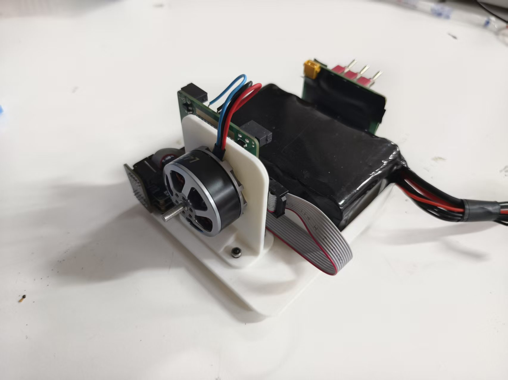

# CYT

整套 CYT2BL3 FOC 电机驱动工程。

- `CYT/FOC_L/`：固件源码和底层工程
- `CYT/上位机/`：电机调试上位机
- `CYT/PCB/`：PCB 工程
- `CYT/电机调试台/`：调试台结构件
- `CYT/数据手册/`：芯片数据手册
- `CYT/上位机讲解视频/`：上位机讲解视频及在线播放地址

当前为开源实验版本。

项目采用 MIT License，第三方 SDK 和底层库仍遵循其各自许可证。

## 上位机讲解视频

[哔哩哔哩在线观看：基于 CYT2BL3 FOC 电机驱动项目开源，包含完整驱动代码、PCB、上位机、电机调试台、数据手册及讲解视频](https://www.bilibili.com/video/BV14Ytx69EH2)

[下载仓库中的上位机讲解原始视频](CYT/上位机讲解视频/上位机讲解%20.mp4)

## 电机调试台

